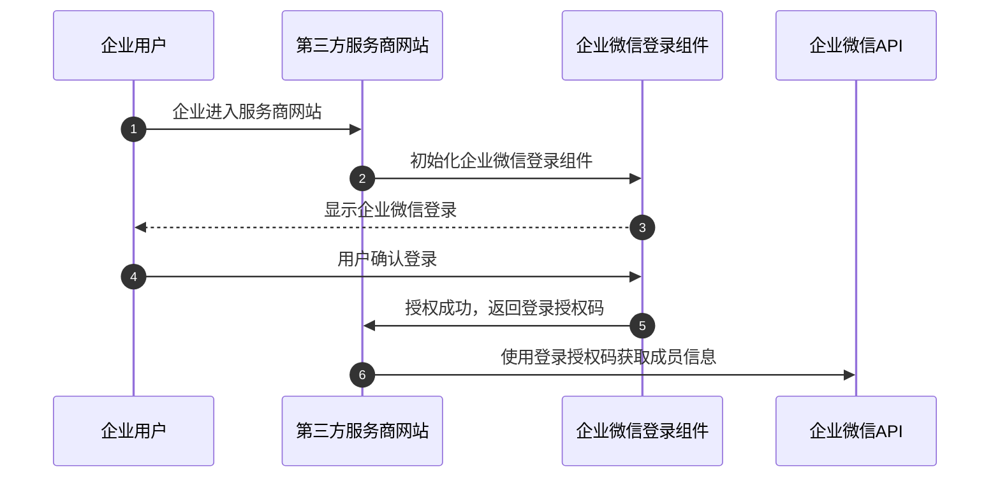
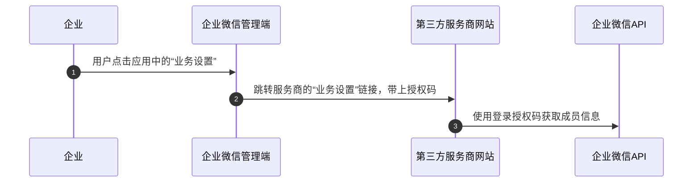

最后更新：2023/03/27

[TOC]
## 概述
企业微信的成员，可通过单点登录机制，登录到第三方网站。第三方可通过接口，获取登录者的身份信息及企业信息。
单点登录包括如下两种场景：
- 成员在第三方网站发起登录授权
- 管理员从企业微信管理端单点登录第三方

## 从第三方单点登录
通过企业微信提供的登录能力，可以让第三方网站在浏览器端打开时，引导成员使用企业微信登录授权，从而获取成员的身份信息。

在进行企业微信授权登录之前，需要先在服务商后台进行配置（见“[开启网页授权登录](#45846/开启网页授权登录)”）。

### 登录方式
新版企业微信登录，除了支持使用移动端企业微信扫码登录之外，还支持通过企业微信桌面端进行快速登录。
- 
新版企业微信登录是对原[扫码登录](#14956)的能力升级，建议开发者升级接入，获得更好的登录体验。

### 企业微信登录流程


**步骤说明：** 
1. 企业成员进入服务商网站
2. 服务商网站引导用户进行企业微信登录
  - 内嵌企业微信登录组件
  - 新窗口打开登录页面
3. 用户确认并同意授权
  - 用户在登录授权页，确认并同意将自己的企业微信和登录账号信息授权给企业或服务商，完成授权流程。
4. 授权后回调URI，得到授权码和过期时间
  - 授权流程完成后，会进入回调URI，并在URI参数中返回授权码，跳转地址 `redirect_uri?code=xxx`
5. 利用授权码调用企业微信的相关API
  - 在得到登录授权码`code`后，企业或服务商即可使用该授权码换取登录授权信息。

### 开启网页授权登录
Web登录使用前需在[服务商后台](https://open.work.weixin.qq.com/wwopen/developer)或者“工作台-企业微信服务商助手”进行如下配置
1. 配置登录授权
- 

2. 配置服务商信息-基本信息-品牌名称
- 
该名称，用于显示在新窗口打开的企业微信登录页面中。
- 

## 从企业微信管理端单点登录
企业微信管理员可从第三方应用的‘业务设置’入口跳转到第三方网站，流程是：


** 步骤说明：** 
1、管理员登录企业微信管理端，点击应用中的“业务设置”。目前仅有托管于服务商的应用有此入口。
2、跳转到第三方服务商的[业务设置URL](#10970/配置开发信息)，服务商据此得到登录授权码。假设"业务设置URL"为https://www.example.com, 那么跳转地址为:
```
https://www.example.com?auth_code=xxx
```
3、利用登录授权码调用相关API。在得到单点登录授权码后，第三方服务商可以使用该授权码[获取登录用户身份](#45859/获取登录用户信息)。
> 注：
>1.使用该功能之前，服务商需要在第三方应用设置-“业务设置”，设置链接。
> 2.若服务商未开启登录授权应用，仍然使用旧的服务商[单点登录](#10991/获取登录用户信息)，则仍然需要通过旧接口[换取登录授权信息](#14957/获取登录用户信息)。若服务商开启登录授权应用后，可切换为[获取登录用户身份](#45859/获取登录用户信息)接口。
