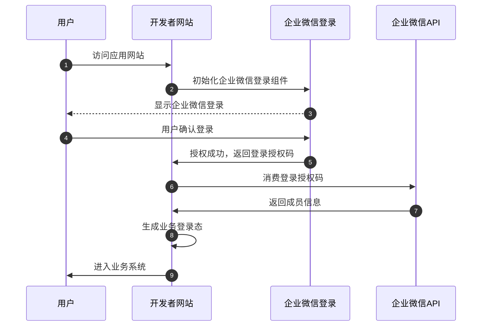

[TOC]
## 简介
通过企业微信提供的登录能力，可以让企业的网站在浏览器内打开时，引导成员使用企业微信登录授权，从而获取成员的身份信息。

在进行企业微信授权登录之前，需要先在企业的管理端后台创建一个具备“企业微信授权登录”能力的应用（见“[开启网页授权登录](#45751/开启网页授权登录)”）。

## 登录方式
新版企业微信登录，除了支持使用移动端企业微信扫码登录之外，还支持通过企业微信桌面端进行快速登录。
- 
新版企业微信登录是对[旧版扫码登录](#15063)的能力升级，建议开发者升级接入，获得更好的登录体验。

## 企业微信登录流程

## 开启网页授权登录
登录 企业管理端后台->进入需要开启的自建应用->点击 “企业微信授权登录”，进入如下页面
- 
然后点击 "设置授权回调域"，输入回调域名，点击“保存”。

**要求配置的授权回调域，必须与访问链接的域名完全一致**。举个例子：
- 假定重定向访问的链接是：http://mail.qq.com:8080/cgi-bin/login：

| 配置域名 | 是否正确 | 原因 |
| --- | --- | --- |
| mail.qq.com:8080 |
-  | 配置域名与访问域名完全一致 |
| email.qq.com |
-  | 配置域名必须与访问域名完全一致 |
| support.mail.qq.com |
-  | 配置域名必须与访问域名完全一致 |
| \*.qq.com |
-  | 不支持泛域名设置 |
| mail.qq.com |
-  | 配置域名必须与访问域名完全一致，包括端口号 |
| http://mail.qq.com:8080 |
-  | 不包括协议头 |
